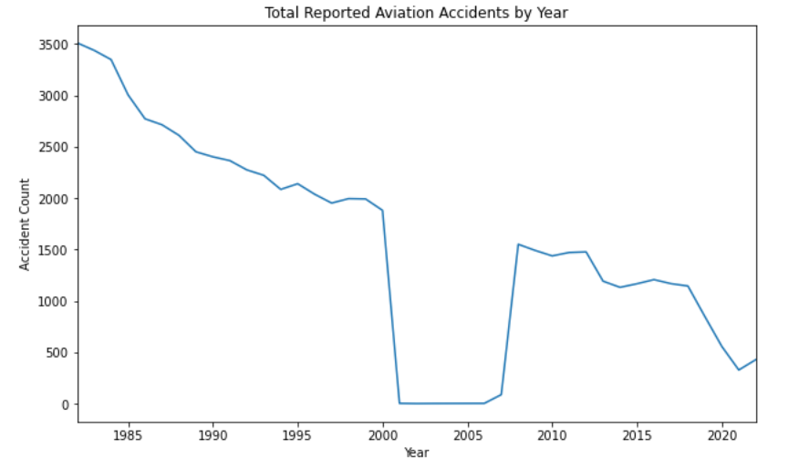
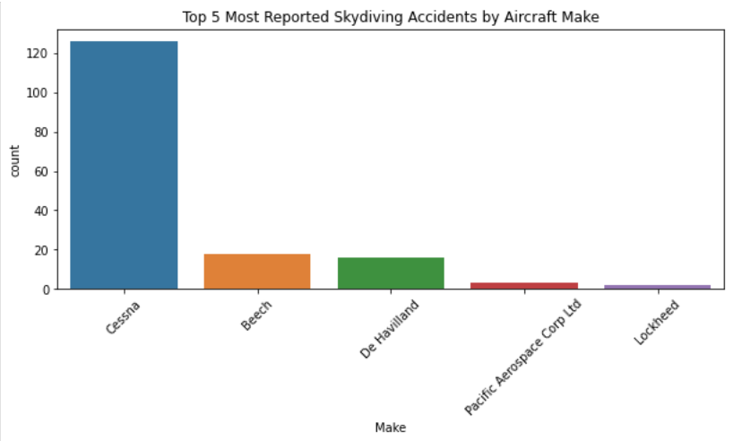
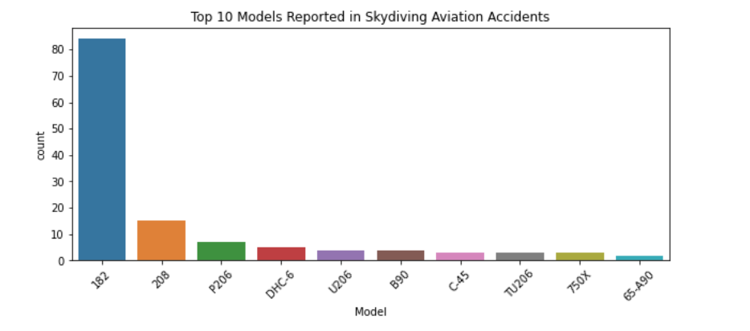
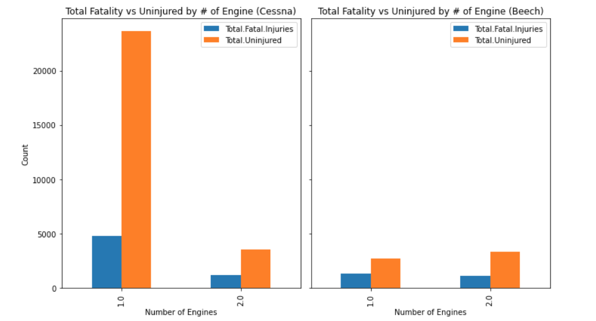
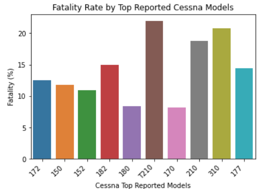
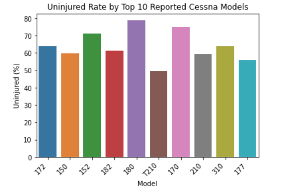

# Aviation Accident Analysis
**Author**: [Morgan Nash](mailto:morganmichellenash@gmail.com)

## Business Understanding
This project aims to determine which planes would be best to look into first for indoor skydiving companies that plan to expand to offer real, outdoor skydiving. Beginner skydiving companies can use this analysis to determine which planes would be of lowest risk to start with as the project will offer recommendations based on vizualizations that show safety comparisons.

## Data Understanding
The data source used in this project is a data set from the National Transportation Safety Board with specifics about US aviation accidents between 1962 through 2023. There are over 90,000 records of specific accidents with 31 columns of information telling location, date, aircraft make, aircraft model, number of engines, total fatal injuries, total uninjured, etc. 

### Data Preparation & Analysis
To clean the data set, many unnecessary columns were dropped. For example: Accident Number, Event ID, Airport Code, Airport Name, etc did not help with analysis. Some rows and columns with a high percent of missing data were also dropped.

A smaller portion of the dataset was used to determine a starting point by looking at commonly reported aircraft Make and Models specific to skydiving. 

Then these makes and models were re-examined in a cleaned version of the original dataset. 

## Conclusion

### Limitations

### Recommendations

### Next Steps
